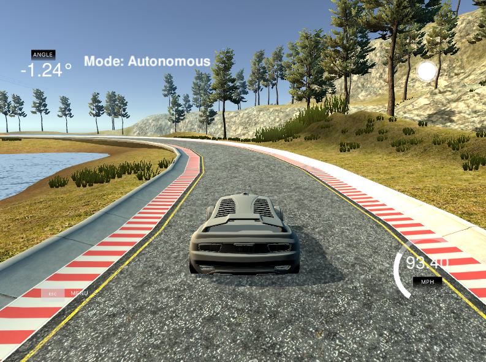

# Final Project
## Autonomous Robots, 2020

This is an autonomous racing car implemented with nonlinear model predictive control (MPC) in a real-time environment, using the basic code construct provided by [CarND-MPC-Project](https://github.com/udacity/CarND-MPC-Project), and tested with Udacity's [autonomous car simulator](https://github.com/udacity/self-driving-car-sim/releases).
Instructions for implementation and compilation can be found in the descriptions below.

In our paper, we review the theories and practice of a nonlinear MPC implemented vehicle, while presenting the results of our experiment as well as an overview of its performance as a racing vehicle. 

In addition, you can also watch our [test simulation video](https://www.youtube.com/watch?v=IgWaym9goIc), showing the model performs in real-time.





---

## Dependencies

* cmake >= 3.5
 * All OSes: [click here for installation instructions](https://cmake.org/install/)
* make >= 4.1(mac, linux), 3.81(Windows)
  * Linux: make is installed by default on most Linux distros
  * Mac: [install Xcode command line tools to get make](https://developer.apple.com/xcode/features/)
  * Windows: [Click here for installation instructions](http://gnuwin32.sourceforge.net/packages/make.htm)
* gcc/g++ >= 5.4
  * Linux: gcc / g++ is installed by default on most Linux distros
  * Mac: same deal as make - [install Xcode command line tools]((https://developer.apple.com/xcode/features/)
  * Windows: recommend using [MinGW](http://www.mingw.org/)
* [uWebSockets](https://github.com/uWebSockets/uWebSockets)
  * Run either `install-mac.sh` or `install-ubuntu.sh`.
  * If you install from source, checkout to commit `e94b6e1`, i.e.
    ```
    git clone https://github.com/uWebSockets/uWebSockets
    cd uWebSockets
    git checkout e94b6e1
    ```
    Some function signatures have changed in v0.14.x. See [this PR](https://github.com/udacity/CarND-MPC-Project/pull/3) for more details.

* **Ipopt and CppAD:** Please refer to [this document](https://github.com/udacity/CarND-MPC-Project/blob/master/install_Ipopt_CppAD.md) for installation instructions.
* [Eigen](http://eigen.tuxfamily.org/index.php?title=Main_Page). This is already part of the repo so you shouldn't have to worry about it.
* Simulator. You can download these from the [releases tab](https://github.com/udacity/self-driving-car-sim/releases).
* Not a dependency but read the [DATA.md](./DATA.md) for a description of the data sent back from the simulator.


## Basic Build Instructions

1. Clone this repo.
2. Make a build directory: `mkdir build && cd build`
3. Compile: `cmake .. && make`
4. Run it: `./mpc`.

## Build with Docker-Compose
The docker-compose can run the project into a container
and exposes the port required by the simulator to run.

1. Clone this repo.
2. Build image: `docker-compose build`
3. Run Container: `docker-compose up`
4. On code changes repeat steps 2 and 3.


